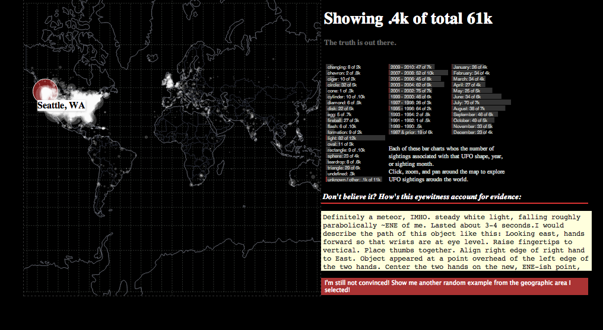
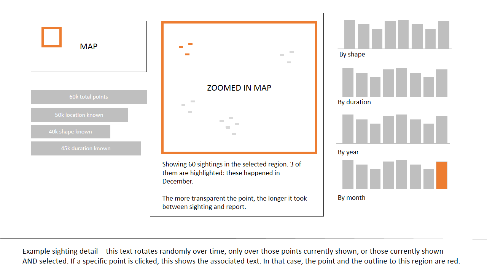

a3-kuksenok-willrs
===============

## Team Members

1. Katie Kuksenok kuksenok@uw.edu
2. Will Scott willrs@uw.edu

## Interactive UFO visualization

Aimed at novice users, this interactive visualization enables answering the questions: "what's the most interesting UFO activity happening in my area? Can I trust it?"

The dataset, containing 60k sightings, dating back over a 100 years due to a prety open-eneded reporting process, needed to be cleaned considerably. Data is largely self reported. entries which were not well-formed have been stripped.

## Running Instructions

Access our visualization at http://cse512-14w.github.io/a3-kuksenok-willrs/ or download this repository and run `python -m SimpleHTTPServer 9000` and access the page from http://localhost:9000/.

## Story Board

- When the user first opens the application, she sees a world map. This map

- We show summary histograms that might be interesting: by shape; by year; by month. Selecting a bar shows a subset of the points - not all, because not all points with shape X have location data, or vice versa. In this sense, there is brushing and linking interaction, but we tried as unobtrusively as possible to get around the incompleteness of the metadata

- We further enable people to dill down to individual data points by clicking on the map. Alternatively, whichever the current "selection" of points is, the corresponding full reports are randomly cycled through on a timer.

### Changes between Storyboard and the Final Implementation

When processing the data we noticed that many of the textual descriptions included notes about nearby missle launches.  We decided that was too cool to ignore, so we mark that statistic.

Figuring out the 'best bar chart' for a subset of data turned out to be difficult, so we show a static set of bar charts on the different types of data breakdown that we had been considering in the story board.

Transitioning from a single map to a map + summaries turned out to be a set of weird user interactions compared to showing the detailed view at all times, but allowing the summaries to reflect pans and zooms to the map.

## Development Process

- Katie did initial explorations of data dirtiness, and interesting phenomenon (the diary from 1910; distribution of lag; various NUFORC notes)
- Will added geolocation data to records, and wrote map interaction.
- Katie built barchart and details rendering

### Data cleaning & access

We both spent time figuring out how to process data; which values were missing, and so on.

The dataset of partial, often unconvincing UFO sightings is something that truly calls for constant closeness to the data. But even 60k records translaes into 80M of data, which is pushing it for a web application - especially if it's not necessary. In dataizer.py, we are doing data cleaning as well as splitting apart raw report text from the metadata, substantially reducing the amount of information we need to load at any given time.

Some of the geolocations are off, like "unknown, IL" showing up over africa. in general the geolocation was surprising accurate, though.

